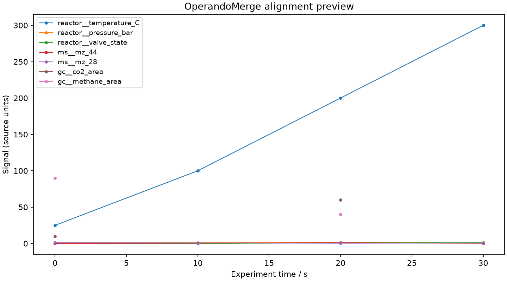

# OperandoMerge

> Synchronize heterogeneous experimental data onto one reproducible timeline.

[](https://github.com/hdkim99/OperandoMerge/actions/workflows/ci.yml)
[](https://www.python.org/)
[](LICENSE)

OperandoMerge aligns reactor loggers, MS, GC, XRD, Raman, FTIR, MFC, and other
CSV/XLSX logs while retaining the original timestamp and value provenance. It
distinguishes continuous, stepwise, event, and discrete-sample channels so sparse
GC measurements are never silently interpolated.



## Install

Python 3.10 or newer is required.

Install directly from the public GitHub repository:

```bash
python -m pip install "operandomerge @ git+https://github.com/hdkim99/OperandoMerge.git"
```

Or use an editable source checkout:

```bash
git clone https://github.com/hdkim99/OperandoMerge.git
cd OperandoMerge
python -m pip install -e .
```

## 30-second quickstart

```bash
operandomerge inspect examples/reactor_logger.csv
operandomerge merge examples/example-config.json \
  --excel operando-report.xlsx \
  --plot alignment.png
operandomerge-gui
```

The desktop UI uses Python's Tk bindings. They are bundled with python.org
installers; distro/Homebrew Python builds may require their matching optional
Tk package (for example `python3-tk` on Debian/Ubuntu).

The XLSX report contains `merged`, `metadata`, `provenance`, `qc`, and
`configuration` sheets. The JSON configuration records every time mapping,
alignment offset, physical delay, channel data type, and resampling policy.

## Scientific definitions

The canonical time coordinate is `experiment_time_s`. For each source:

```text
experiment_time_s = source_time_s + alignment_offset_s - total_delay_s
total_delay_s = manual + sampling + transport + dead_volume + analysis
```

A positive delay means an instrument reports after the phenomenon or sample
occurred, so delay correction moves the reported point earlier. Reference-event
alignment uses `target_event_time_s - source_event_time_s` as its alignment
offset. Absolute timestamps are parsed as timezone-aware UTC values and measured
from the configured ISO-8601 `experiment_origin`, or from the earliest
absolute/injection timestamp when no origin is supplied. Elapsed inputs are
assumed to share that experiment origin unless an offset is provided.

Resampling is deliberately semantic:

| Data type | v0.1 policy |
|---|---|
| `continuous` | linear, nearest, or none; never extrapolated beyond measured range |
| `stepwise` | causal previous-value hold or none |
| `event` | exact timestamp only; never interpolated |
| `discrete_sample` | exact timestamp only; never interpolated |

Duplicate source times are reported by QC. Numeric resampling uses the last row at
a duplicate time deterministically, while all original input rows remain in the
source file and the duplicate is not hidden.

## GUI workflow

`operandomerge-gui` provides the complete v0.1 workflow: add multiple files, map
the time column and representation, assign every channel's data type/output name,
choose alignment and delay components, select the target timeline, preview the
real merged result, save the reproducible configuration, and export Excel. The
GUI controller calls the same `MergeService` as the CLI and contains no scientific
calculation formulas.

## Python API

```python
from pathlib import Path
from operandomerge.config import load_config
from operandomerge.export import export_excel
from operandomerge.service import MergeService

datasets, merge_config = load_config(Path("examples/example-config.json"))
result = MergeService().run(datasets, merge_config)
export_excel(result, Path("operando-report.xlsx"))
```

## Support status

Supported in v0.1.0:

- CSV and one selected XLSX sheet per input
- multiple files; absolute, injection, elapsed-second, elapsed-minute, and
  midnight-wrapping instrument-local clocks
- absolute, elapsed, manual-offset, and reference-event alignment
- explicit manual/sampling/transport/dead-volume/analysis delay correction
- union or named reference timeline
- type-aware merging, value-level provenance, QC, figures, CSV bundle, and Excel
- CLI, Tk GUI, public Python API, and synthetic scientific regression tests

Experimental:

- automatic time-column guesses in the GUI (always review the mapping)
- robust-MAD possible-outlier warnings

Planned, not implemented:

- cross-correlation alignment
- vendor-native binary formats
- automatic physical dead-volume calculation from apparatus geometry

## Validation and limits

Tests recover known synthetic offsets, verify midnight rollover, confirm continuous
linear interpolation and stepwise holds, and assert that GC/event values remain
missing between actual samples. Provenance is checked back to file, source row,
column, original timestamp, offset, delay, and interpolation method.

OperandoMerge cannot infer whether clocks refer to the same physical event. Users
must supply defensible offsets/delays. It does not alter or overwrite raw files.
See [scientific validation](docs/scientific-validation.md) and
[configuration reference](docs/configuration.md).

## Development

```bash
python -m pip install -e '.[dev]'
ruff check .
mypy src
pytest
python -m build
```

Contributions are welcome under [CONTRIBUTING.md](CONTRIBUTING.md). Please cite
the software using [CITATION.cff](CITATION.cff).
